# OpenResearch Quick Start

> 从论文出发，初始化原子图谱，为原子创建实验，运行并回收结果，再把证据回写到图中，形成一个最小可工作的研究闭环。

## 1. 启动项目

根据你的系统下载对应的 [Release](https://github.com/openResearch1/openresearch/releases/tag/v1.0) 版本。下载完成后，在终端进入文件所在目录并运行可执行文件：

- Linux 和 macOS 通常需要先赋予执行权限再运行：`chmod +x ./可执行文件名 && ./可执行文件名`。其中 macOS 如果首次运行被系统拦截，除了执行权限外，通常还需要去掉下载文件的隔离属性，可执行 `xattr -cr ./可执行文件名` 后再运行；如果仍被拦截，可在“系统设置 -> 隐私与安全性”中允许后重新打开。
- Windows 一般不需要单独赋予执行权限，解压后可直接在 PowerShell 或 CMD 中运行 `.\可执行文件名.exe`；如果系统提示文件被拦截，可以右键文件打开“属性”并勾选“解除锁定”，或在 PowerShell 中执行 `Unblock-File .\可执行文件名.exe`。
- 启动成功后，终端会输出本地访问地址，例如 http://127.0.0.1:4096
  在浏览器中打开即可使用 OpenResearch。

系统会进行HealthCheck, 尽量保证相应的依赖已经正确安装以获得最佳的使用体验

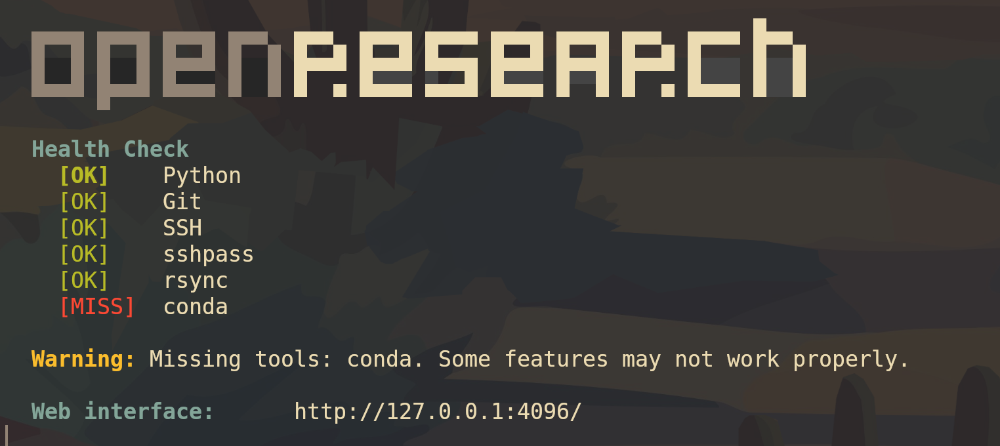

- Python: agent 运行脚本、编译
- Git：管理代码仓库、分支、提交和实验代码版本
- SSH：连接远程服务器，执行部署和实验命令
- sshpass：让脚本能自动带密码执行 SSH / SCP，方便无人值守部署
- rsync：高效同步本地和远程代码、资源，只传变化部分
- conda：管理本地资源下载环境

## 2. 创建研究项目

在首页点击 **Open project**。

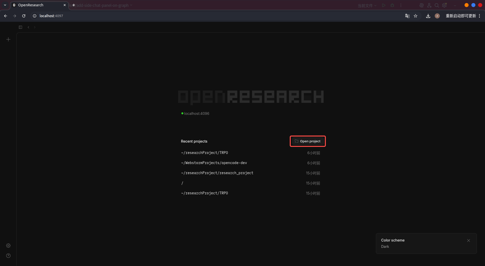

随后在弹窗中点击 **New Research Project**。

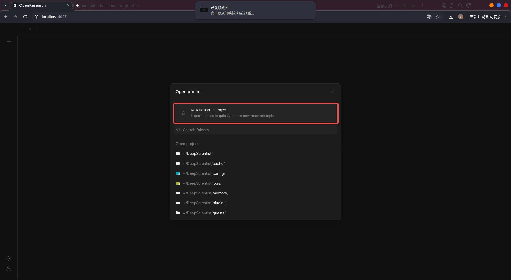

接着填写项目名称、选择项目目录，并导入与你研究主题相关的论文。支持导入 PDF，也支持 LaTeX source folder。这里导入的论文会作为后续初始化原子图谱的输入。

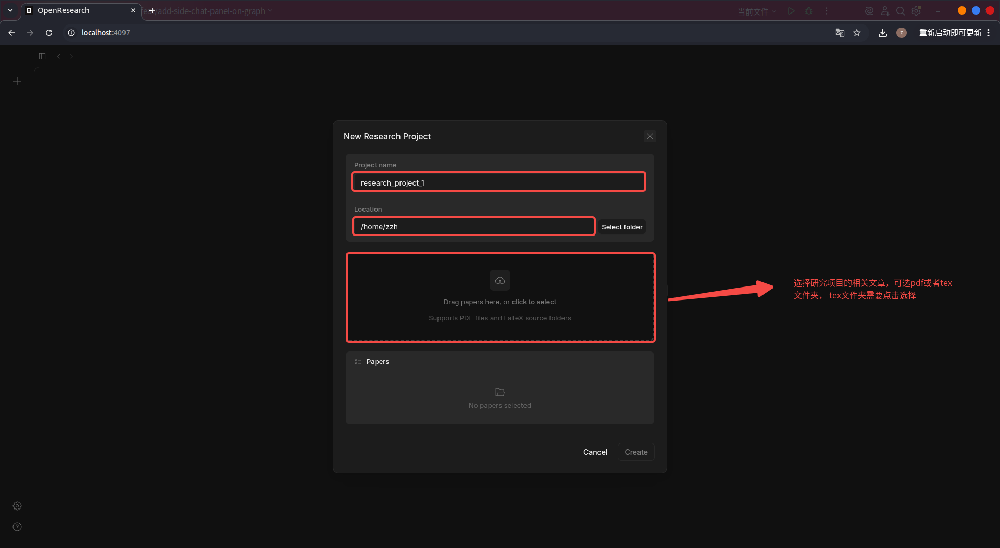

## 3. 初始化原子图谱

进入项目后，在主界面的对话区使用 `@research_project_init`，让系统根据已导入的论文生成项目的初始原子图谱。

这一步的目标是：

- 解析论文内容
- 拆分出最小粒度的科学原子
- 建立原子之间的关系
- 生成项目的初始研究结构

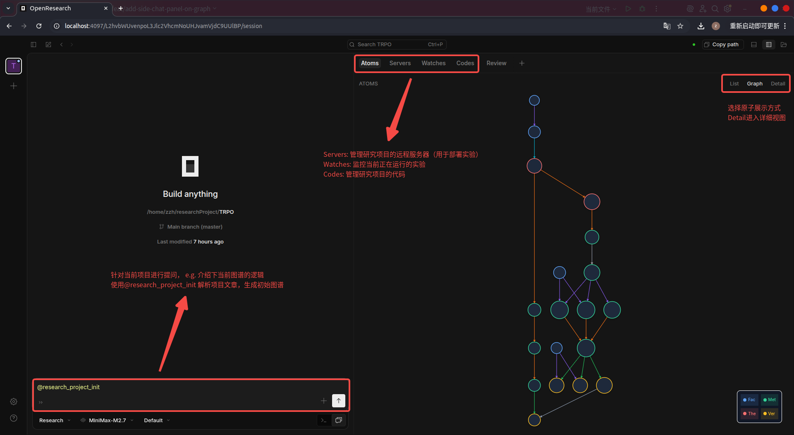

初始化完成后，你就可以在右侧看到项目的原子图，并在顶部切换不同工作区：

- **Atoms**：管理项目中的研究原子
- **Servers**：管理远程实验服务器
- **Watches**：查看实验监控与同步状态
- **Codes**：管理实验代码仓库或本地代码路径
- **Review**：查看和整理项目过程中的审阅信息

## 4. 配置远程服务器与 W&B

在 **Servers** 页面中，配置远程服务器信息，以及默认资源目录、W&B 项目名和 API Key。

这里的服务器用于部署和运行实验；资源目录用于存放实验过程中的代码、日志、模型参数和其他资源；W&B 用于监控实验进度与结果。

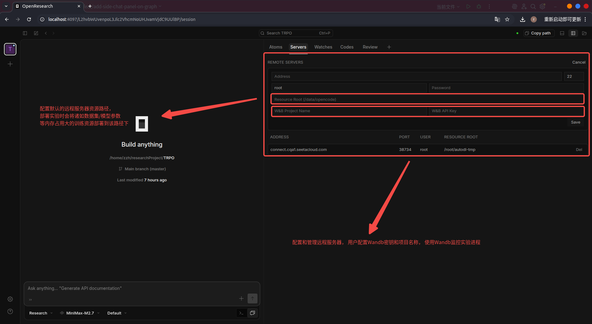

## 5. 注册项目代码

在 **Codes** 页面中，添加项目代码。你可以填写 GitHub 仓库地址，也可以直接选择本地代码路径；同时可以将这份代码与某篇论文或某个研究对象关联起来。

这一步的目的，是让后续实验可以明确地基于哪份代码进行派生、修改、运行和追踪。

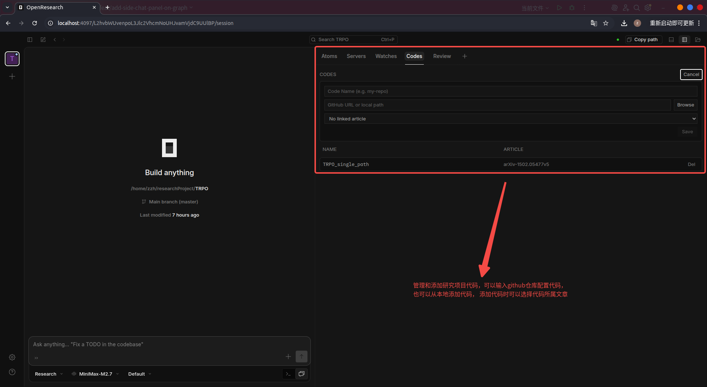

## 6. 浏览项目总体状态

完成初始化后，可以先在 **Atoms** 页面中浏览项目当前的整体原子图。右上角支持不同展示模式，例如 **List**、**Graph** 和 **Detail**。

如果你当前想理解研究结构，可以先看图；如果你想进入某个具体原子的工作流，就直接点进该原子。

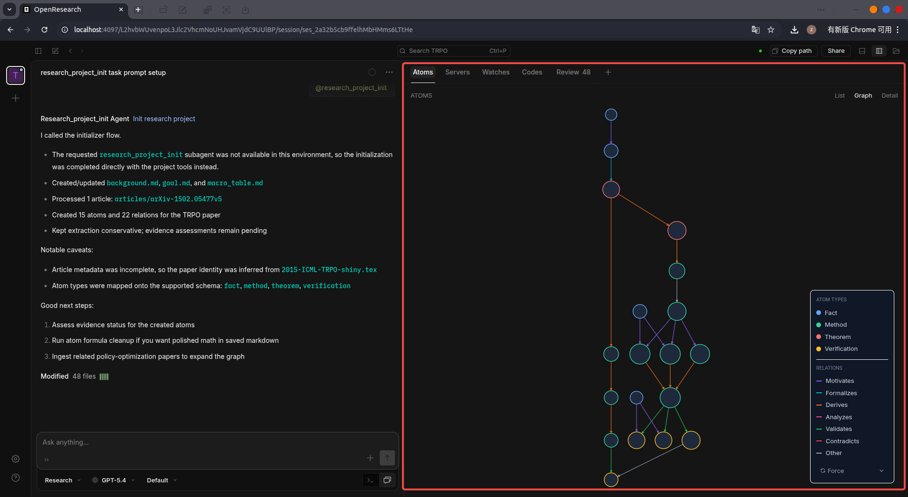

## 7. 进入原子详情页

在原子图中点击某个原子，进入它的详情页。

在详情页中你可以看到：

- 原子的类型与验证状态
- 当前 claim
- 已关联的 experiments
- evidence / assessment 面板
- 原子级聊天入口

这一步相当于从“项目级图谱”进入“单个科学问题”的工作台。

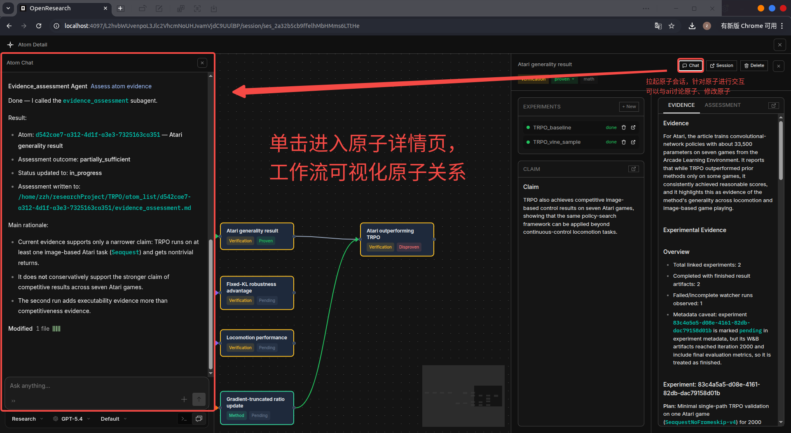

## 8. 为原子创建实验

在原子详情页中点击 **New** 创建实验。

创建实验时，需要指定：

- **Experiment Name**：实验名称
- **Code Path**：本次实验基于的代码
- **Baseline Branch**：要继承的基线分支

OpenResearch 会把实验与原子绑定，让实验不再是孤立运行的脚本，而是服务于某个明确的 claim。

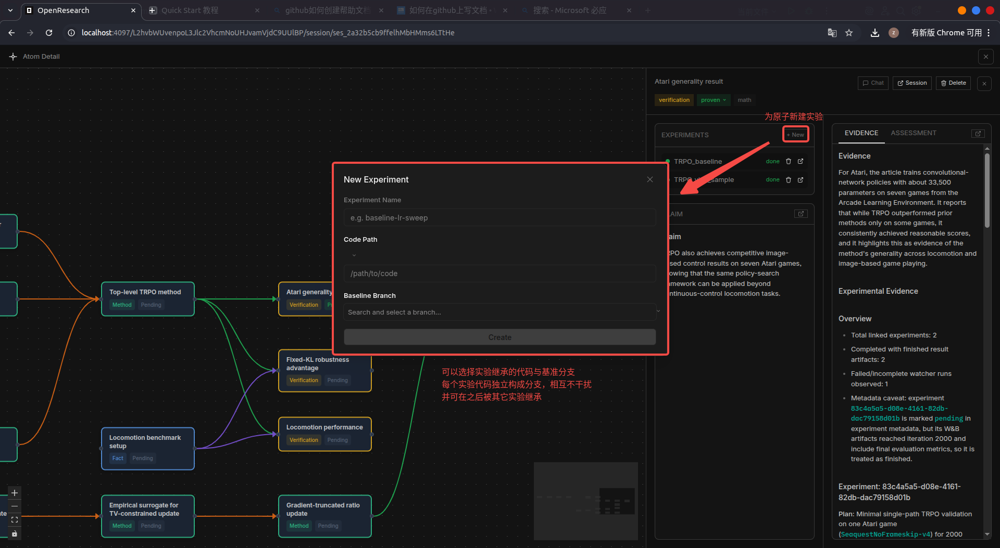

## 9. 查看实验计划与结果

进入实验详情页后，可以看到：

- 本次实验所绑定的分支与基线分支
- 远程服务器信息
- 代码路径
- 实验计划（Plan）
- 运行结果（Result）
- 关联的 run 产物，例如配置、summary、W&B 记录

如果需要进一步调试代码，也可以通过页面中的入口在 VSCode 中打开当前实验对应的代码。

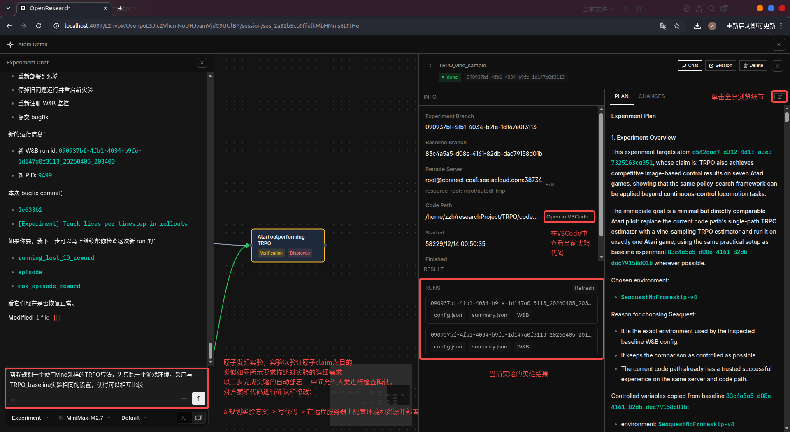

## 10. 检查实验代码变更

在实验的 **Changes** 页面里，可以查看本次实验相对于基线的代码修改。

这一步非常重要，因为它把“实验结果”与“具体代码差异”连接了起来。你不仅能看到实验是否成功，还能知道：

- 改了哪些文件
- 每个文件增删了什么
- 本次结果对应的是哪一版实现

这样后续回看时，实验结果就不会脱离实现上下文。

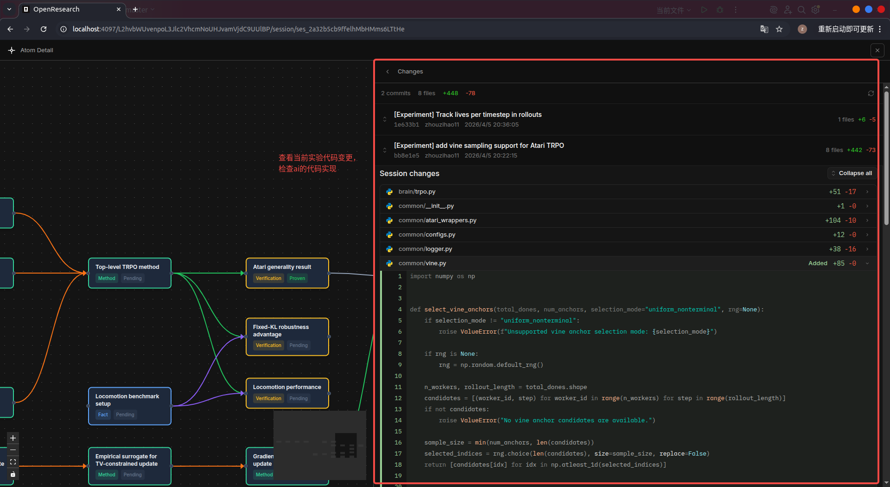

## 11. 监控实验运行状态

在 **Watches** 页面中，可以统一查看当前项目下所有实验 watcher 的状态。

这里适合做两件事：

- 跟踪实验是否已经完成
- 统一查看 Summary / Config / W&B / Sync 等同步信息

当项目逐渐变复杂后，这个页面会成为你管理实验生命周期的重要入口。

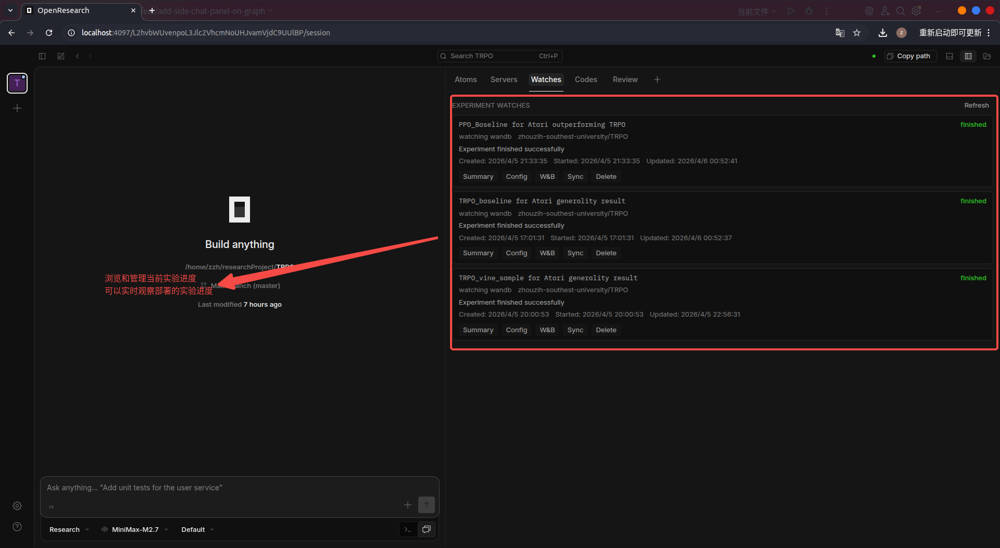

## 12. 回收实验结果并写回原子

当实验完成后，回到原子级聊天面板，先使用 `@experiment_summary` 对该原子下的实验结果做总结；然后再使用 `@evidence_assessment`，根据实验结果生成证据评估，判断当前 claim 是否被支持，并给出下一步 refine 建议。

这一步是 OpenResearch 最关键的闭环：

1. 原子提出一个 claim
2. 围绕 claim 创建实验
3. 实验产生结果
4. AI 总结结果并评估证据
5. 证据回写到原子图中
6. 原子的验证状态随之更新

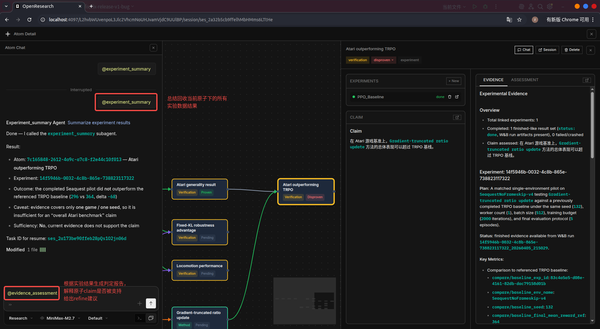

## 13. 一个最小闭环是什么样的

如果你只想快速体验一遍 OpenResearch，最推荐的最小闭环是：

1. 创建一个研究项目
2. 导入 1～2 篇论文
3. 使用 `@research_project_init` 生成初始图谱
4. 选择一个你最关心的原子
5. 为该原子创建一个小实验
6. 运行实验并观察结果
7. 用 `@experiment_summary` 总结结果
8. 用 `@evidence_assessment` 把证据写回原子

走完这 8 步，你就能看到 OpenResearch 的核心工作方式：

**研究不是“写一篇论文”，而是持续维护一个可追踪的声明—证据图谱。**

## 14. OpenResearch 的使用思路

你可以把 OpenResearch 理解为一个研究操作系统：

- 项目是研究容器
- 原子是最小研究对象
- 实验是验证 claim 的执行单元
- 代码变更是实验实现的具体载体
- 证据评估决定原子的当前状态
- 图谱则记录整个研究过程如何持续展开

所以在 OpenResearch 中，真正被管理的不是“文件”或“对话”，而是：

**声明、证据、实验、代码与决策之间的关系。**
